# 🎬 Netflix Clone Website

A fully responsive front-end clone of the Netflix homepage built using HTML and CSS. This project replicates the design and layout of Netflix's landing page, including image carousels, responsive sections, and smooth navigation.

---

## 📄 Description

This Netflix Clone project is designed to practice front-end web development using only HTML and CSS. It includes a modern layout with:
- A responsive header with a logo and navigation options
- Featured banner section
- Multipage website including Login, Home, Profile, Pricing pages
- Multiple content sliders like “New Releases” and “Only on Netflix”
- Carousel-style navigation using arrow buttons
- Fully responsive design for desktop and mobile devices

---

## 🚀 Live Demo

Check out the live version here:  
🔗 [Netflix Clone Website](https://netflix-clone-flax-three-56.vercel.app/home.html)

---

## 🖼️ Screenshots

### 🔹 Desktop View

  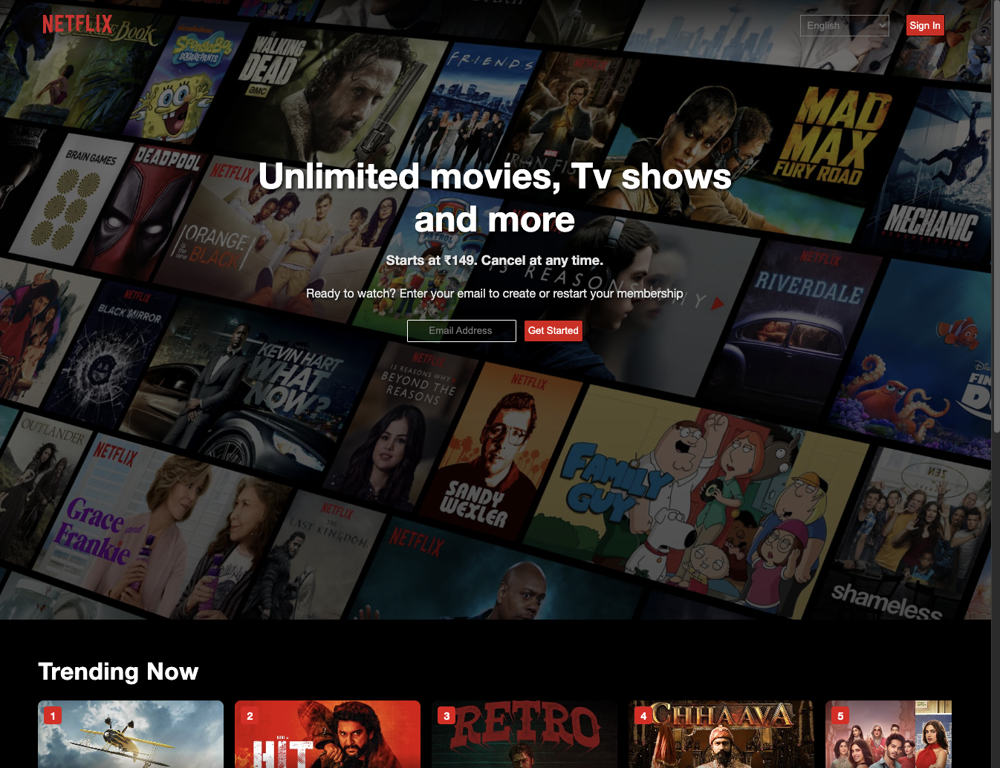
  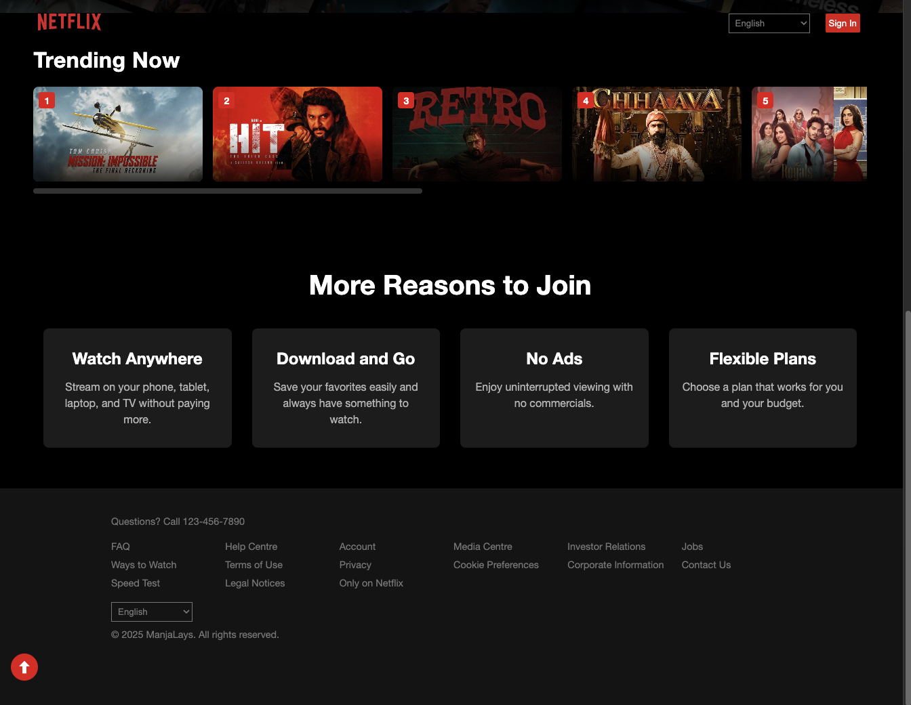

 

  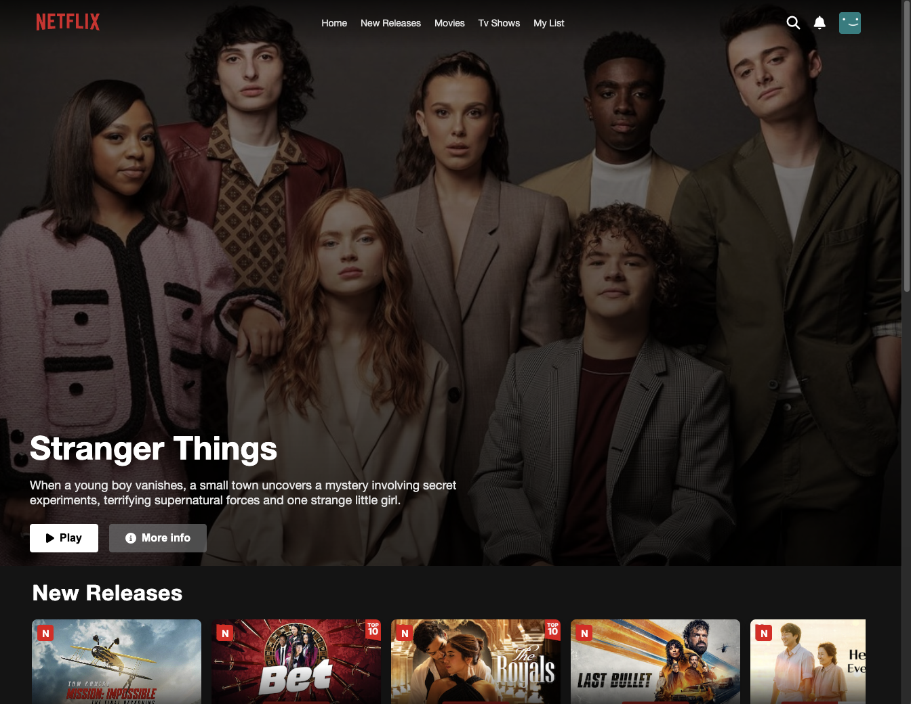
  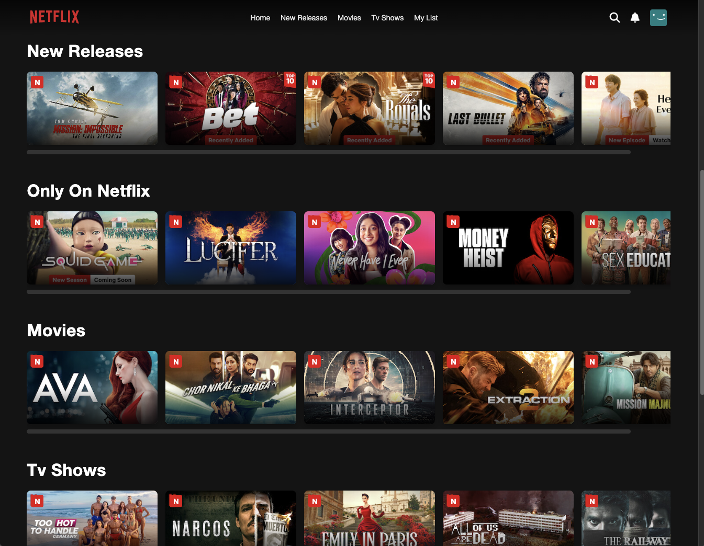

 

  
  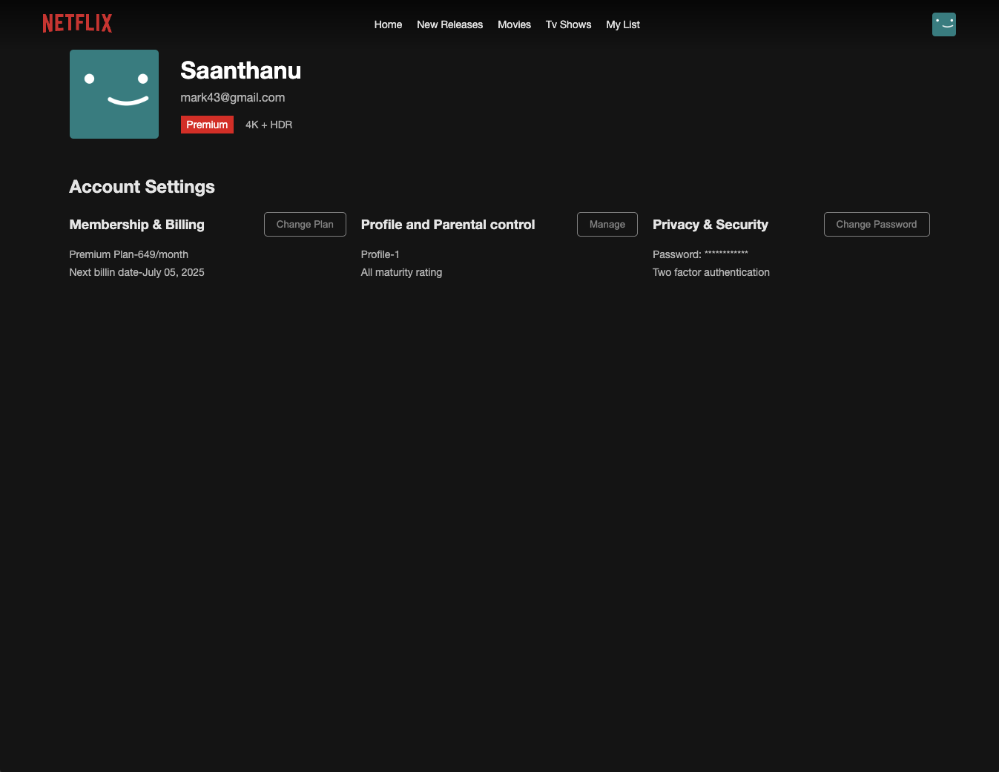

 

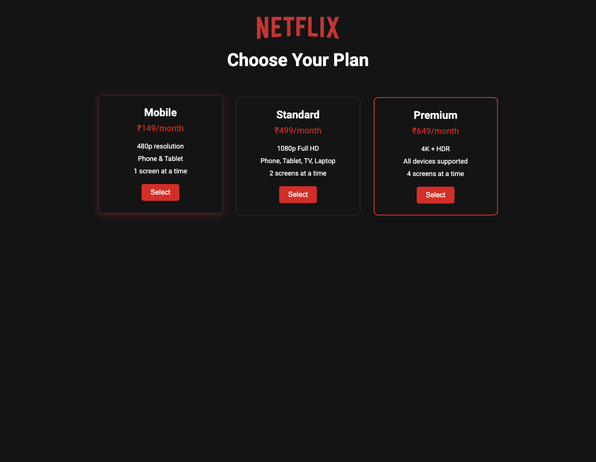

---

### 🔹 Mobile View

  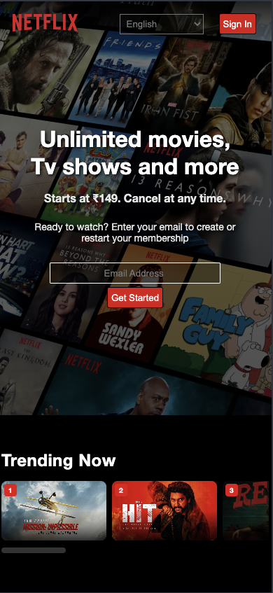
  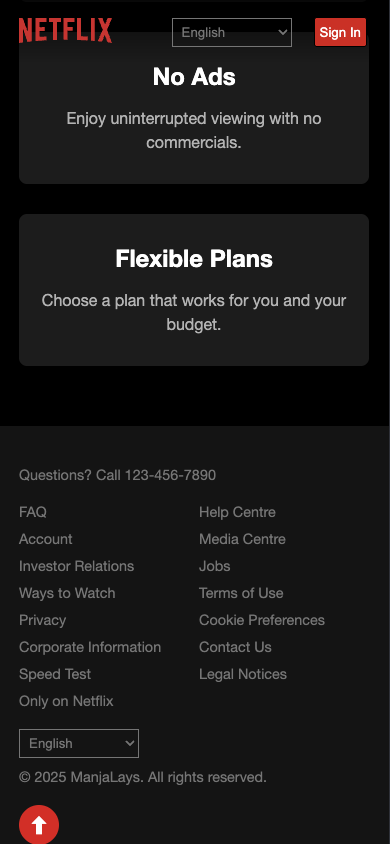
  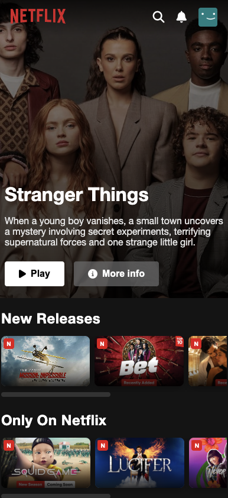
  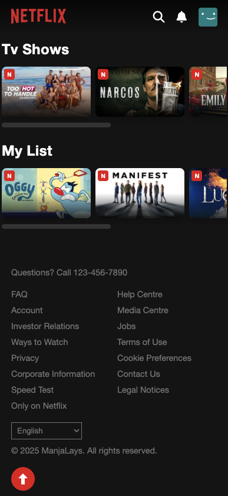
  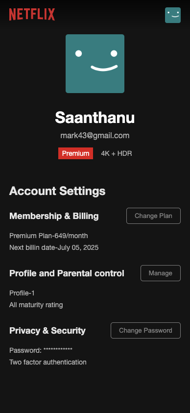
  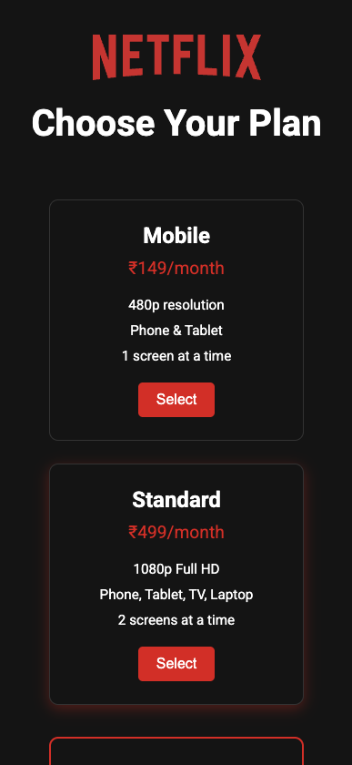

---

## 🛠️ Technologies Used

- **HTML5**
- **CSS3**
- **JavaScript**
- Responsive Web Design (Media Queries)
- Font Awesome (for icons)

---

## 👨‍💻 Author

**Saanthanu Prasad**  
🌐 [GitHub](https://github.com/manjalays)  
📫 mail.saanthanuprasad@gmail.com

---

## 📢 Credits

- This project was built as part of a **5-day Bootcamp hosted by Devtown**.
- All logos, UI references, and branding used in this project belong to **Netflix**.
- This project is intended for **educational and portfolio purposes only**. No commercial use is intended.
